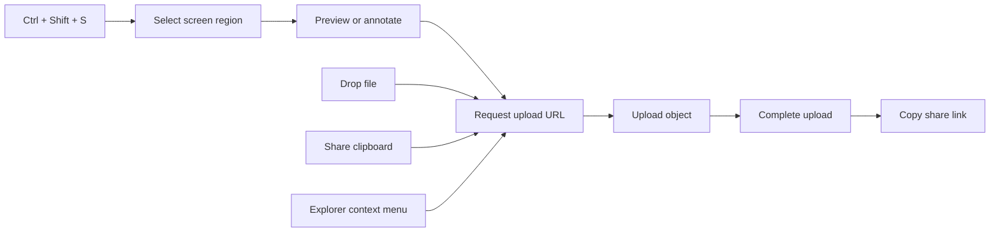
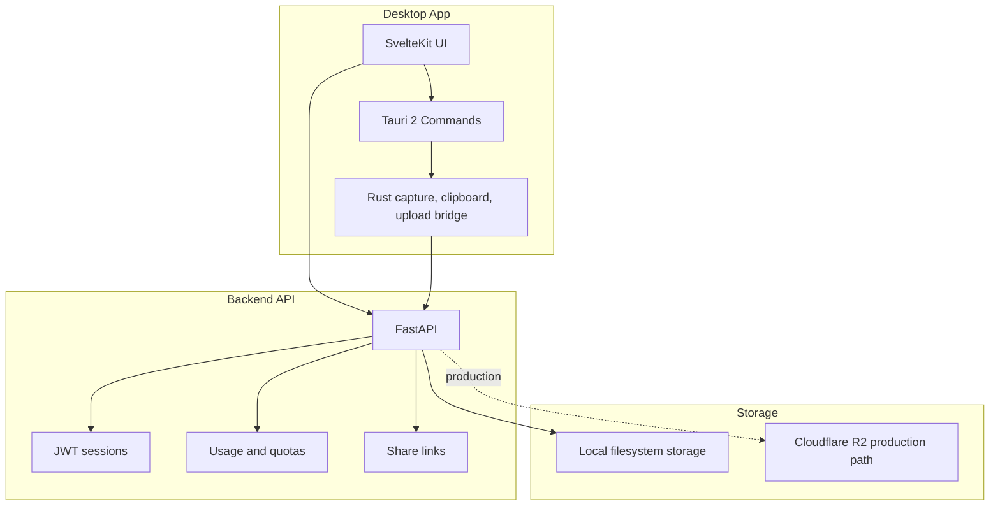

<div align="center">
  <br />
  
  <br />

  <h1>Snaply</h1>

  <p>
    <strong>Capture. Share. Done.</strong>
  </p>

  <p>
    A fast Windows desktop tool for turning screenshots, files, and clipboard content into clean share links.
  </p>

  <p>
    <a href="https://github.com/DulinNethmira/snaply/releases/latest">
      
    </a>
    <a href="https://github.com/DulinNethmira/snaply/actions">
      
    </a>
    <a href="LICENSE">
      
    </a>
    
  </p>

  <p>
    <a href="https://github.com/DulinNethmira/snaply/releases/latest"><strong>Download for Windows</strong></a>
    ·
    <a href="#local-development"><strong>Run locally</strong></a>
    ·
    <a href="RELEASE.md"><strong>Release guide</strong></a>
    ·
    <a href="CHANGELOG.md"><strong>Changelog</strong></a>
  </p>

  <br />
</div>

---

## What Snaply Does

Snaply is built for the moment after you capture something: the bug screenshot, the design detail, the log snippet, the file someone needs right now. Press a shortcut, select the area, and Snaply prepares a share link without forcing you through a browser tab, manual upload form, or chat attachment flow.

<table>
  <tr>
    <td width="33%">
      <h3>Lightning Capture</h3>
      <p>Use <kbd>Ctrl</kbd> + <kbd>Shift</kbd> + <kbd>S</kbd> to open the capture overlay, select a region, preview it, and share.</p>
    </td>
    <td width="33%">
      <h3>Direct Sharing</h3>
      <p>Files upload through short-lived upload URLs, then Snaply gives you a clean public link.</p>
    </td>
    <td width="33%">
      <h3>Desktop Native</h3>
      <p>Built with Tauri 2, Rust, and SvelteKit for a lightweight Windows-first workflow.</p>
    </td>
  </tr>
</table>

## Highlights

| Area | Capability |
| --- | --- |
| Screenshot capture | Global hotkey, multi-monitor overlay, crop preview |
| File sharing | Drag-and-drop uploads, file picker uploads, Windows Explorer context menu |
| Clipboard | Share clipboard images, text, and supported clipboard content |
| Account system | JWT auth, secure local token storage, current-user share history |
| Backend | FastAPI, SQLite, local storage for development, Cloudflare R2-ready storage path |
| Releases | Tauri updater, NSIS installer, GitHub Actions release workflow |
| Safety | Explicit CORS, no wildcard production origins, session-backed auth, expiring share tokens |

## Experience Flow



## Architecture



## Tech Stack

<table>
  <tr>
    <th>Layer</th>
    <th>Tools</th>
    <th>Purpose</th>
  </tr>
  <tr>
    <td>Desktop shell</td>
    <td>Tauri 2, Rust</td>
    <td>Native windowing, global shortcuts, tray, secure OS integration</td>
  </tr>
  <tr>
    <td>Frontend</td>
    <td>SvelteKit, TypeScript, CSS tokens</td>
    <td>Fast interface, dashboard, auth, upload controls</td>
  </tr>
  <tr>
    <td>Backend</td>
    <td>FastAPI, SQLAlchemy, SQLite</td>
    <td>Auth, upload lifecycle, usage tracking, share links</td>
  </tr>
  <tr>
    <td>Storage</td>
    <td>Local filesystem, Cloudflare R2-ready adapter</td>
    <td>Local testing and production object storage flow</td>
  </tr>
  <tr>
    <td>Release</td>
    <td>GitHub Actions, NSIS, Tauri updater</td>
    <td>Windows installers and signed update metadata</td>
  </tr>
</table>

## Repository Map

```txt
snaply/
├─ apps/
│  ├─ desktop/                 # Tauri 2 + SvelteKit Windows app
│  │  ├─ src/                  # UI routes, components, stores, styles
│  │  └─ src-tauri/            # Rust commands, capture, tray, updater
│  └─ backend/                 # FastAPI backend
│     ├─ app/api/              # Auth, uploads, shares, users, health
│     ├─ app/core/             # Config, storage, cleanup, security
│     ├─ app/db/               # SQLAlchemy session/base
│     └─ tests/                # API and share-page coverage
├─ packages/shared/            # Shared package workspace
├─ services/api/               # Service workspace
├─ .github/workflows/          # Release validation and publishing
├─ CHANGELOG.md
├─ RELEASE.md
└─ README.md
```

## Local Development

### Requirements

- Windows 10/11
- Node.js 20+
- Rust stable
- Python 3.10+
- PowerShell

### Start The Backend Only

From the repository root:

```powershell
.\dev.ps1 -BackendOnly
```

Backend URLs:

```txt
API:  http://127.0.0.1:8000
Docs: http://127.0.0.1:8000/docs
```

### Start Backend + Desktop App

```powershell
.\dev.ps1
```

### Reset Local Test Data

```powershell
.\dev.ps1 -Reset
```

This removes the local SQLite database and local storage folder used during development.

<details>
<summary><strong>Manual setup commands</strong></summary>

Backend:

```powershell
cd apps\backend
python -m venv venv
.\venv\Scripts\pip install -r requirements.txt
copy .env.local .env
.\venv\Scripts\uvicorn.exe app.main:app --host 127.0.0.1 --port 8000 --reload
```

Desktop:

```powershell
cd apps\desktop
npm install
npm run tauri dev
```

</details>

## Validation

Run these before tagging a release:

```powershell
cd apps\desktop
npm run check
npm run build

cd src-tauri
cargo check

cd ..\..\backend
$env:PYTHONPATH=(Get-Location).Path
.\venv\Scripts\python.exe -m pytest
```

Current expected backend result:

```txt
30 passed
```

## Release Flow

Stable releases are created from version tags:

```powershell
git tag v0.1.3
git push origin main
git push origin v0.1.3
```

GitHub Actions then validates, builds the Windows installer, prepares updater metadata, and publishes the GitHub Release.

Read the full signing and release process in [RELEASE.md](RELEASE.md).

## Security Notes

- Never commit `.env`, signing keys, GitHub tokens, database files, or generated local storage.
- Production CORS origins must be explicit.
- The backend requires a real `SECRET_KEY`.
- R2 credentials and updater signing keys belong in GitHub Actions secrets.
- Local development storage is not production storage.

## Roadmap

- Hosted production backend
- Cloudflare R2 production deployment
- Google OAuth sign-in
- Stronger device registration and multi-device sync
- Richer share management
- Signed Windows production certificate

## License

MIT © 2026 Snaply

<div align="center">
  <br />
  <sub>Built for the moment when a screenshot needs to become a link.</sub>
  <br />
</div>
